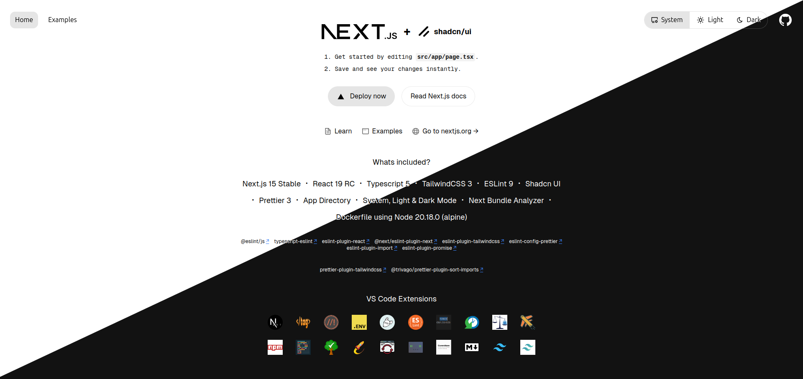

# 🎓 Anh's Full-Stack Learning Journey - Todo App

 [](https://typescriptlang.org)   

Welcome to my full-stack learning project! 🚀 This Todo application is where I'm exploring and mastering modern web development technologies. It's not just a todo app - it's my playground for learning everything from frontend React patterns to backend API design.

> **Learning in public by Anh Duong** 📚✨

## 🔗 Related Repositories

This is a **full-stack project** with separate frontend and backend repositories:

- **Frontend (This Repo)**: Modern React/Next.js application
- **Backend**: [todo-app-be-nodejs](https://github.com/VieEng121419/todo-app-be-nodejs) - Node.js API server

Both repositories are part of my complete full-stack learning journey!



## 📖 My Learning Journey

### 🎯 What I'm Learning Through This Project

**Frontend Mastery:**
- 🔥 **React 19** - Latest features and patterns
- ⚡ **Next.js 15** - App Router, Server Components, and modern React
- 🎨 **UI/UX Design** - Building beautiful, accessible interfaces
- 📱 **Responsive Design** - Mobile-first approach
- 🔍 **TypeScript** - Type safety and better developer experience

**Backend Development:**
- 🌐 **API Design** - RESTful APIs and best practices
- 🗄️ **Database Management** - Data modeling and relationships
- 🔐 **Authentication** - User management and security
- 🚀 **Deployment** - From development to production

**Full-Stack Integration:**
- 🔄 **State Management** - Frontend-backend communication
- 📊 **Data Flow** - Understanding the complete data lifecycle
- 🛡️ **Security** - Best practices for web security
- 📈 **Performance** - Optimization across the stack

### 🗓️ Learning Timeline

- **Week 1-2**: Setting up the project structure and basic UI
- **Week 3-4**: Implementing authentication system
- **Week 5-6**: Building core todo functionality
- **Week 7-8**: Backend API development
- **Week 9-10**: Full-stack integration
- **Week 11-12**: Testing, optimization, and deployment

## ✨ Features I'm Building & Learning

### 🎨 Frontend Features
- 🔐 **Authentication System** - Login/signup with validation
- 🌐 **Social Login** - OAuth with Google and Facebook
- 📝 **Todo Management** - CRUD operations with beautiful UI
- 🌙 **Theme System** - Dark/light mode implementation
- 📱 **Responsive Design** - Works perfectly on all devices
- 🎭 **Animations** - Smooth transitions and micro-interactions

### Frontend
```typescript
- Framework: Next.js 15 (App Router)
- Language: TypeScript 5
- Styling: Tailwind CSS 4
- UI Library: shadcn/ui
- Forms: React Hook Form + Zod
- State: React Query (TanStack Query)
- Icons: Lucide React
- Animations: Framer Motion
```

### Backend (Planned)
```typescript
- Runtime: Node.js
- Framework: Express.js
- Database: MongoDB
- Authentication: JWT
```

> 🔗 **Backend Repository**: [todo-app-be-nodejs](https://github.com/VieEng121419/todo-app-be-nodejs)

## 🏗️ Project Structure

```
src/
├── app/                    # Next.js App Router
│   ├── sign-in/           # Authentication pages
│   ├── sign-up/           # User registration
│   ├── dashboard/         # Main todo interface (coming soon)
│   ├── api/               # API routes (coming soon)
│   └── layout.tsx         # Root layout
├── components/            # Reusable UI components
├── lib/                   # Utilities and configurations
├── hooks/                 # Custom React hooks
└── registry/              # shadcn/ui components
```

## 🚀 Getting Started

Want to see my learning progress? Here's how to run the project:

### Prerequisites
- Node.js 20.18.0 or higher
- bun (recommended) or npm/yarn/pnpm

### Installation

1. **Clone the repository**:
   ```bash
   git clone https://github.com/anhduong/todo-app-fe.git
   cd todo-app-fe
   ```

2. **Install dependencies**:
   ```bash
   bun install
   # or
   npm install
   ```

3. **Run the development server**:
   ```bash
   bun dev
   # or
   npm run dev
   ```

4. **Open** [http://localhost:3000](http://localhost:3000) in your browser

## 📚 What I'm Learning & Documenting

### 🔍 Current Focus Areas

**Week 3-4: Authentication Deep Dive**
- [x] Form validation with Zod schemas
- [x] React Hook Form integration
- [x] UI components with shadcn/ui
- [ ] OAuth implementation
- [ ] Session management
- [ ] Password reset flow

**Week 5-6: Backend Integration**
- [ ] Connect frontend to [backend API](https://github.com/VieEng121419/todo-app-be-nodejs)
- [ ] User authentication flow
- [ ] API error handling
- [ ] Loading states and UX

**Upcoming Learning Goals:**
- Backend API development
- Database design and relationships
- Real-time features with WebSockets
- Testing strategies (unit, integration, e2e)
- Performance optimization
- Security best practices

### 📖 Learning Resources I'm Using

- **Next.js Documentation** - Official guides and best practices
- **TypeScript Handbook** - Mastering type safety
- **React Patterns** - Modern React development
- **Full-Stack Course** - [Course name/link if applicable]
- **YouTube Tutorials** - Various creators
- **GitHub Repos** - Studying open-source projects

## 💡 Key Learning Insights

### 🧠 What I've Learned So Far

1. **Component Architecture**: How to structure reusable components with proper TypeScript types
2. **Form Handling**: React Hook Form + Zod provides excellent developer experience
3. **Styling**: Tailwind CSS utility-first approach speeds up development
4. **Type Safety**: TypeScript catches so many errors before runtime
5. **Next.js App Router**: Server Components and client components work together beautifully

### 🔧 Challenges I've Overcome

- **Form Validation**: Learning Zod schema validation patterns
- **Component Composition**: Understanding shadcn/ui component patterns
- **TypeScript Errors**: Debugging type issues and generic constraints
- **Responsive Design**: Mobile-first CSS with Tailwind

## 🌟 Learning Goals for 2025

### Q1 2025: Frontend Mastery
- [ ] Master React 19 features
- [ ] Advanced TypeScript patterns
- [ ] Animation and micro-interactions
- [ ] Performance optimization
- [ ] Accessibility best practices

### Q2 2025: Backend Development
- [ ] Node.js and Express.js
- [ ] Database design with PostgreSQL
- [ ] API development best practices
- [ ] Authentication and authorization
- [ ] File handling and storage

### Q3 2025: Full-Stack Integration
- [ ] Real-time features
- [ ] Advanced state management
- [ ] Testing strategies
- [ ] Security implementation
- [ ] Performance monitoring

### Q4 2025: Production & Scaling
- [ ] CI/CD pipelines
- [ ] Cloud deployment
- [ ] Monitoring and logging
- [ ] Code quality automation
- [ ] Documentation practices

## 🤝 Learning Community

I believe in learning in public! Feel free to:

- 📧 **Ask questions** about my learning process
- 💡 **Share suggestions** for improvements
- 🔗 **Connect** if you're on a similar learning journey
- 🐛 **Report issues** you find in the code
- 🌟 **Star the repo** if you find it helpful for your own learning

### 📬 Connect with Me

- **GitHub**: [@anhduong](https://github.com/anhduong)
- **Email**: anh.duong.learning@gmail.com
- **LinkedIn**: [Anh Duong - Full-Stack Developer](https://linkedin.com/in/anhduong)
- **Twitter**: [@anhduong_dev](https://twitter.com/anhduong_dev)

## 📄 License

This project is licensed under the MIT License - see the [LICENSE.md](LICENSE.md) file for details.

## 🙏 Acknowledgments & Learning Resources

Thanks to the amazing developers and educators who make learning possible:

- **Next.js Team** - For an incredible framework
- **Vercel** - For excellent documentation and deployment
- **shadcn** - For beautiful, accessible UI components
- **The React Community** - For endless learning resources
- **Open Source Contributors** - For sharing knowledge freely

---

<div align="center">

**📚 Learning in Public | 🚀 Building the Future | 💡 Sharing Knowledge**

*This README is a living document that evolves with my learning journey!*

</div>